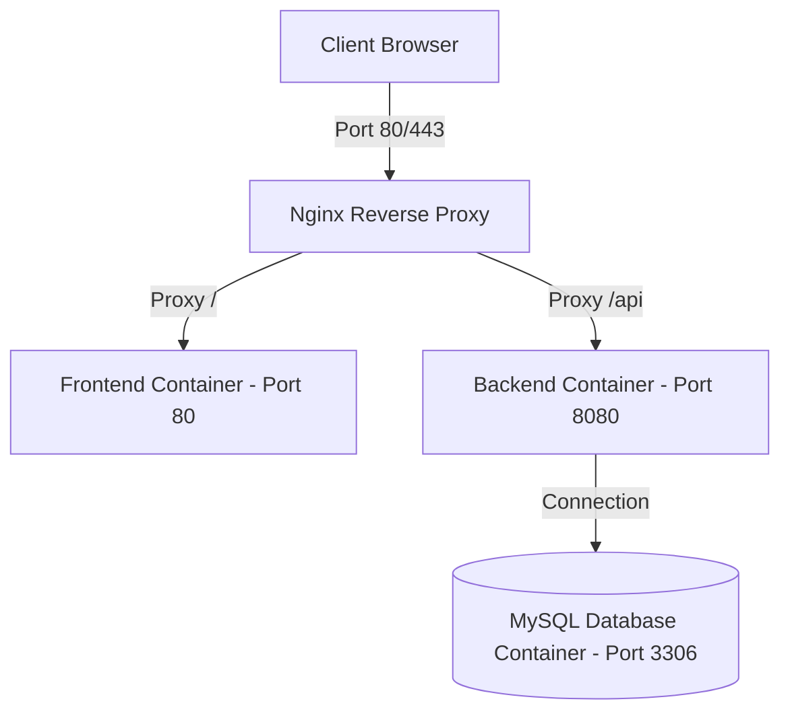

# Docker Deployment Guide

FreshMart Pro uses Docker to containerize all services, facilitating simple deployments.

## Services Architecture



## Dockerfiles

### Frontend (`infra/docker/Dockerfile.frontend`)
- **Stage 1:** Node.js alpine base to build the React application.
- **Stage 2:** Nginx alpine base to serve the static built SPA.

### Backend (`infra/docker/Dockerfile.backend`)
- **Stage 1:** Maven package phase using OpenJDK 21.
- **Stage 2:** Eclipse Temurin JRE 21 execution container.

## Commands Reference

### Start Services (Detached Mode)
```bash
docker compose -f infra/docker/docker-compose.yml up --build -d
```

### Stop Services
```bash
docker compose -f infra/docker/docker-compose.yml down
```

### View Logs
```bash
docker compose -f infra/docker/docker-compose.yml logs -f
```

### Inspect Database Container
```bash
docker exec -it freshmart-db mysql -u root -p
```
