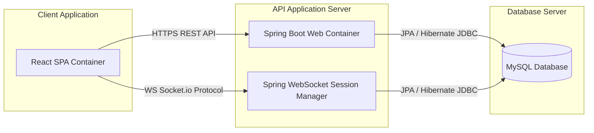

# Container Diagram

The Container diagram illustrates the logical boundaries, data stores, and backend components of the system.

## Containers Description

1. **React SPA Container (Frontend)**:
   - **Tech Stack:** React 19, TypeScript, Redux Toolkit, Tailwind CSS, Framer Motion.
   - **Responsibilities:** Renders the user interfaces, handles client state management, handles animations, connects to APIs, and plays live updates via socket notifications.
   
2. **Spring Boot Container (Backend REST API)**:
   - **Tech Stack:** Java 21, Spring Boot 3, Spring Security (JWT, OAuth2), Spring Data JPA.
   - **Responsibilities:** Executes business logic, handles transactional boundaries, authorizes user request queries, processes cart calculations, validates data inputs, and integrates external payments.

3. **WebSocket Service Container**:
   - **Tech Stack:** Spring WebSocket messaging handler.
   - **Responsibilities:** Manages live browser socket subscriptions for updates like order tracks and inventory counts.

4. **MySQL Database**:
   - **Tech Stack:** MySQL 8 database instance.
   - **Responsibilities:** Persists users, products, categories, orders, wallets, logs, and review ratings.
