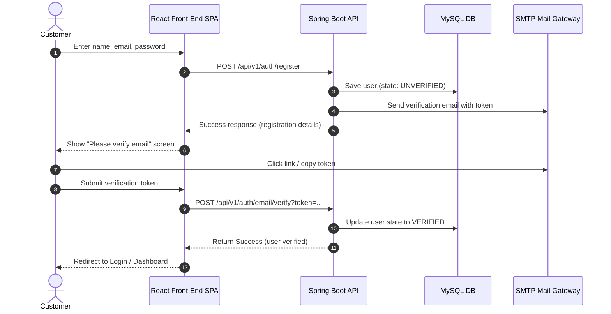
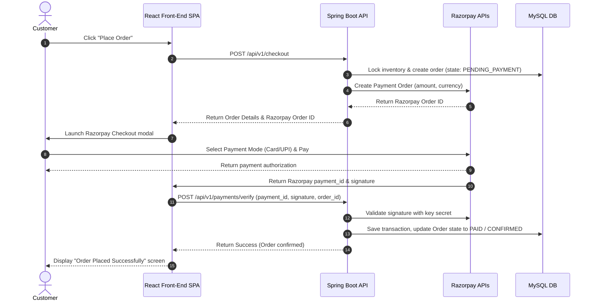
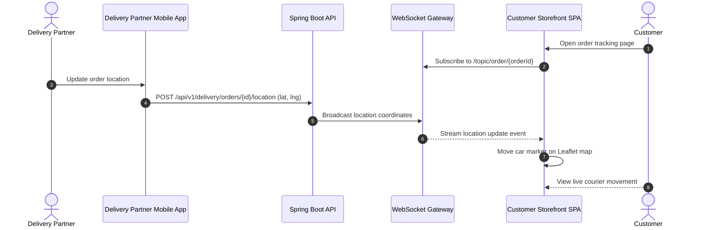

# Sequence Diagrams

These sequence diagrams detail key multi-party interactions in the system.

## 1. Authentication and Registration Flow

## 2. Checkout and Razorpay Integration Flow

## 3. Real-Time Order Tracking Workflow

