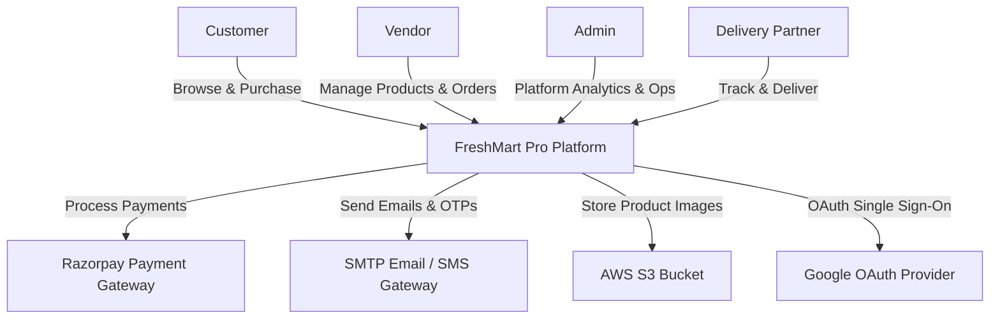

# System Context Diagram

The System Context diagram outlines the interactions between FreshMart Pro and external entities.

## Descriptions

### Entities
1. **Customer**: Uses the mobile-first storefront to search for groceries, checkout, and track orders.
2. **Vendor**: Manages store catalog, modifies stock quantities, and reviews revenue analytics.
3. **Admin**: Supervises the overall ecosystem, creates campaigns, manages coupons, and reviews site audits.
4. **Delivery Partner**: Handles courier tasks, updates fulfillment state, and monitors personal payouts.

### Integrations
1. **Razorpay**: Processes all customer payment flows securely.
2. **SMTP / SMS Server**: Sends onboarding notifications, OTP tokens, and invoices.
3. **AWS S3**: Hosts static product assets securely.
4. **Google OAuth**: Integrates sign-on capability.
